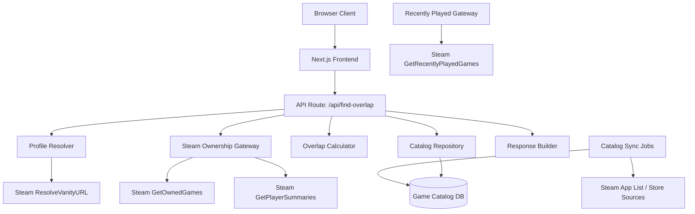
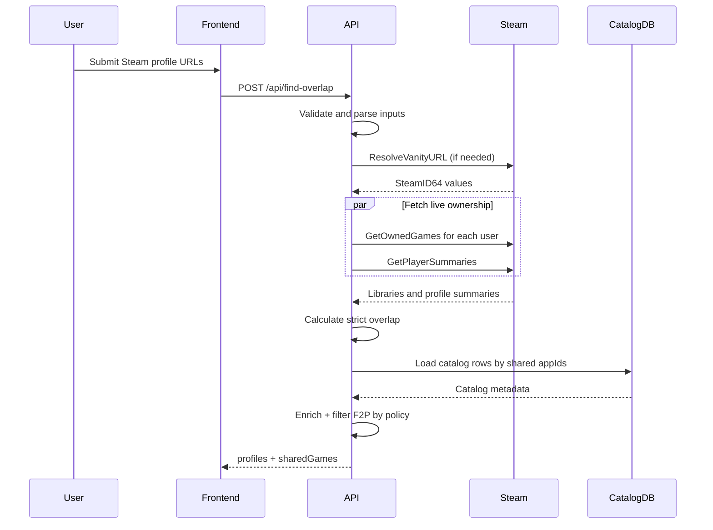
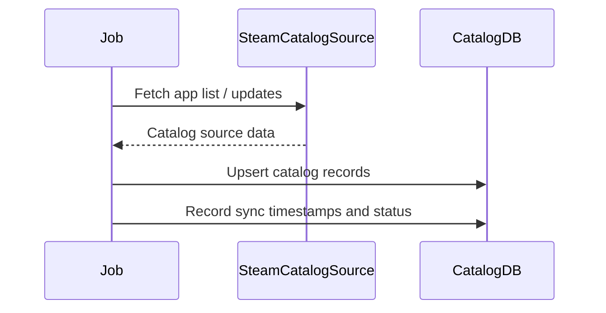

# Design Document: Steam Game Overlap Finder

## Overview

The Steam Game Overlap Finder helps groups of 2-6 friends decide what to play by combining two data sources:

- live ownership data from Steam for the specific users in the request
- locally stored game metadata maintained by the application

The MVP user-facing behavior stays simple: accept Steam profile URLs, find games owned by all users, and display enriched results. The architecture, however, is designed to support future features such as free-to-play entitlements, ownership-threshold recommendations, multiplayer filtering, and ranking by recently played signals without forcing request-time fan-out across many Steam endpoints.

The main architectural decision is:

- Steam is the source of truth for who owns what
- the application database is the source of truth for game metadata needed for filtering, pricing, and future ranking

## Architecture



### Architectural Principles

- Keep request-time Steam calls narrow and predictable
- Do not perform per-game enrichment calls during overlap requests
- Store catalog metadata locally and refresh asynchronously
- Preserve a clean boundary between Steam integration code and domain logic
- Keep MVP behavior simple while shaping the backend for future roadmap features

## Data Flow

### MVP Request Flow

1. User submits 2-6 Steam profile URLs
2. API route validates and parses inputs
3. Vanity URLs are resolved to SteamID64 values
4. Owned libraries and player summaries are fetched live from Steam
5. Overlap is computed by `appId`
6. Shared `appId`s are joined against the local game catalog
7. Free-to-play titles are filtered out by default on the server
8. Enriched `sharedGames` are returned to the frontend

### Background Catalog Flow

1. A catalog sync job performs an initial app-list backfill
2. Additional jobs enrich catalog rows with metadata such as free/paid classification and play-mode flags
3. Refresh jobs update stale records asynchronously
4. Request-time endpoints never depend on per-game Steam calls for catalog enrichment

## Components and Interfaces

### Component 1: ProfileInputForm

**Purpose**: Collect and validate Steam profile URLs on the client

**Responsibilities**:

- Render 2-6 input fields
- Validate vanity and numeric Steam profile URLs
- Reject raw SteamID64 input
- Prevent duplicates
- Submit profile URLs to `/api/find-overlap`

### Component 2: ProfileResolver

**Purpose**: Resolve profile URLs to SteamID64 identifiers

**Interface**:

```typescript
interface ProfileResolverService {
  resolveProfile(input: ParsedProfile): Promise<ResolvedProfile>
  resolveBatch(inputs: ParsedProfile[]): Promise<ResolvedProfile[]>
}
```

**Responsibilities**:

- Parse vanity and numeric profile URLs
- Call `ResolveVanityURL` when needed
- Preserve enough source information for meaningful errors

### Component 3: SteamOwnershipGateway

**Purpose**: Fetch live ownership data and player summary data from Steam

**Interface**:

```typescript
interface SteamOwnershipGateway {
  fetchOwnedLibrary(steamId64: string): Promise<GameLibrary>
  fetchOwnedLibraries(steamIds: string[]): Promise<Map<string, GameLibrary>>
  fetchPlayerSummaries(steamIds: string[]): Promise<Map<string, SteamPlayerSummary>>
}
```

**Responsibilities**:

- Call `GetOwnedGames` with `include_appinfo=1`, `include_played_free_games=1`, and `format=json`
- Detect private/inaccessible libraries
- Normalize Steam responses into app-level types
- Fetch player summary metadata for display purposes

### Component 4: RecentlyPlayedGateway

**Purpose**: Provide backend support for future ranking features

**Interface**:

```typescript
interface RecentlyPlayedGateway {
  fetchRecentlyPlayedGames(steamId64: string): Promise<RecentlyPlayedLibrary>
}
```

**Responsibilities**:

- Call `GetRecentlyPlayedGames`
- Normalize its response for internal use
- Stay separate from the MVP response contract

### Component 5: CatalogRepository

**Purpose**: Read and write locally stored game metadata

**Interface**:

```typescript
interface CatalogRepository {
  getGamesByAppIds(appIds: number[]): Promise<Map<number, CatalogGame>>
  upsertGames(games: CatalogGame[]): Promise<void>
  markSyncStatus(job: CatalogSyncJob): Promise<void>
}
```

**Responsibilities**:

- Store app-level catalog records
- Support enrichment lookups during overlap requests
- Track freshness and sync status

### Component 6: CatalogSyncService

**Purpose**: Populate and refresh the local catalog asynchronously

**Interface**:

```typescript
interface CatalogSyncService {
  backfillCatalog(): Promise<SyncResult>
  refreshCatalog(since?: Date): Promise<SyncResult>
}
```

**Responsibilities**:

- Perform initial app-list backfill
- Refresh catalog data incrementally where supported
- Keep enrichment out of the user request path

### Component 7: OverlapCalculator

**Purpose**: Compute group overlap and preserve room for future recommendation models

**Interface**:

```typescript
interface OverlapCalculatorService {
  calculateSharedGames(libraries: GameLibrary[]): SteamGame[]
  calculateOwnershipCounts(libraries: GameLibrary[]): Map<number, number>
}
```

**Responsibilities**:

- Compute strict overlap for MVP
- Deduplicate by `appId`
- Keep the internal design extensible for threshold-based recommendations later

### Component 8: ResultEnricher

**Purpose**: Join overlap output against catalog metadata and apply backend policy

**Interface**:

```typescript
interface ResultEnricher {
  enrichSharedGames(
    sharedGames: SteamGame[],
    catalogGames: Map<number, CatalogGame>,
    policy: ResultPolicy,
  ): EnrichedSharedGame[]
}
```

**Responsibilities**:

- Merge ownership-derived games with local catalog metadata
- Filter F2P titles for MVP/free-tier output
- Preserve response compatibility while supporting future entitlements

## Data Models

### Model 1: ResolvedProfile

```typescript
interface ResolvedProfile {
  originalUrl: string
  steamId64: string
  profileUrl: string
  vanityName?: string
  personaName?: string
  avatarUrl?: string
}
```

### Model 2: SteamGame

```typescript
interface SteamGame {
  appId: number
  name: string
  playtimeForever: number
  imgIconUrl: string
  imgLogoUrl: string
  headerImageUrl: string
  rtimeLastPlayed?: number
}
```

### Model 3: CatalogGame

```typescript
interface CatalogGame {
  appId: number
  name: string
  isFree?: boolean
  priceText?: string
  priceCurrency?: string
  hasOnlineCoop?: boolean
  hasOnlinePvp?: boolean
  hasLan?: boolean
  hasSharedSplitScreen?: boolean
  isGroupPlayable?: boolean
  catalogLastSyncedAt?: string
  storeLastSyncedAt?: string
}
```

### Model 4: EnrichedSharedGame

```typescript
interface EnrichedSharedGame extends SteamGame {
  isFree?: boolean
  isGroupPlayable?: boolean
}
```

### Model 5: RecentlyPlayedLibrary

```typescript
interface RecentlyPlayedLibrary {
  steamId64: string
  totalCount: number
  games: Array<{
    appId: number
    playtime2Weeks?: number
    playtimeForever?: number
  }>
}
```

### Model 6: FindOverlapResponse

```typescript
interface FindOverlapResponse {
  success: boolean
  data?: {
    profiles: ResolvedProfile[]
    sharedGames: EnrichedSharedGame[]
  }
  error?: APIError
}
```

The response intentionally stays narrow for MVP. It does not expose recently played data, threshold recommendations, or plan-only metadata until those features are actually launched.

## Sequence Diagrams

### MVP Overlap Request



### Catalog Sync Flow



## Error Handling

### Error Categories

- `INVALID_INPUT`: malformed request body, wrong profile count, unsupported URL format, duplicates
- `PROFILE_RESOLUTION_FAILED`: vanity URL could not be resolved
- `PRIVATE_LIBRARY`: one or more required libraries are not publicly accessible
- `API_ERROR`: Steam service failures or unexpected upstream conditions

### Failure Strategy

The MVP uses strict failure mode:

- if any required profile cannot be resolved, the request fails
- if any required library is private or inaccessible, the request fails
- if catalog enrichment is missing for some titles, the request still succeeds using the available ownership-derived game data where possible

## Performance Considerations

- Steam calls for profiles are done concurrently
- Overlap calculation is in-memory and server-side
- Per-game metadata is not fetched live during overlap requests
- Catalog enrichment reads should be batched by `appId`
- Recently played support exists behind a separate gateway and is not part of the MVP response path

## Roadmap Compatibility

This design intentionally supports the following future additions without replacing the core request path:

- paid-tier inclusion of F2P titles
- frontend show/hide toggles for F2P titles after backend authorization
- ownership-threshold recommendation sets
- pricing-aware candidate suggestions
- multiplayer-only filtering based on local catalog metadata
- ranking by recently played signals

