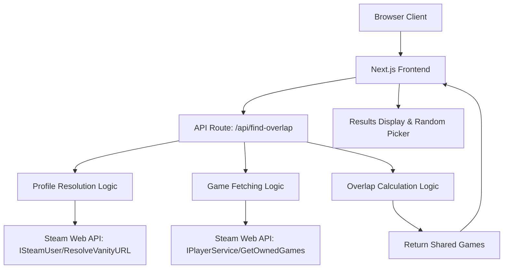
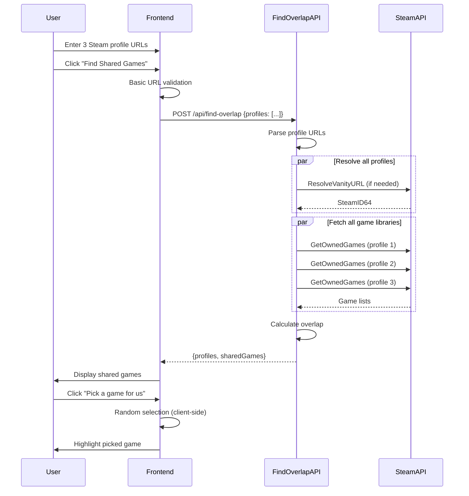
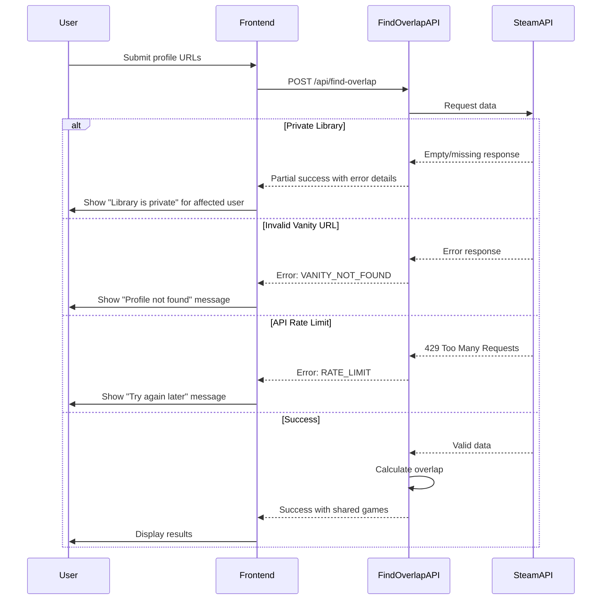

# Design Document: Steam Game Overlap Finder

## Overview

The Steam Game Overlap Finder is a web application that helps groups of friends discover which games they can play together by analyzing their Steam libraries. Users input 2-6 Steam profile URLs (vanity or numeric format), and the system fetches each user's owned games via the Steam Web API, computes the intersection of games owned by all users, and displays the shared games with an optional random picker for quick decision-making.

The MVP focuses on ownership overlap detection without multiplayer compatibility filtering, treating this as a practical tool for answering "What can we all play together right now?" The application is designed as a stateless, client-focused Next.js application with server-side API routes handling Steam API interactions, optimized for fast delivery and learning value.

**Important Note**: Raw SteamID64 input is not supported due to Steam API limitations. Users must provide Steam profile URLs in either vanity format (steamcommunity.com/id/username) or numeric format (steamcommunity.com/profiles/[SteamID64]).

## Architecture



The architecture follows a simplified client-server pattern where:
- The Next.js frontend handles user input and renders results
- A single API route `/api/find-overlap` handles all server-side logic: profile resolution, game fetching, and overlap calculation
- Server-side processing reduces client complexity, minimizes API calls, and centralizes business logic
- No database is required for MVP; all state is ephemeral
- Steam Web API provides profile resolution and game ownership data

## Components and Interfaces

### Component 1: ProfileInputForm

**Purpose**: Collects and validates Steam profile URLs or SteamID64s from users

**Interface**:
```typescript
interface ProfileInputFormProps {
  onSubmit: (profiles: string[]) => void
  minProfiles?: number
  maxProfiles?: number
}

interface ProfileInputFormState {
  profiles: string[]
  errors: Map<number, string>
  isValidating: boolean
}
```

**Responsibilities**:
- Render dynamic input fields (2-6 profiles)
- Add/remove profile input fields
- Validate URL format client-side (vanity or numeric profile URLs only)
- Prevent duplicate inputs
- Trigger submission when valid
- Display placeholder text: "Paste Steam profile URLs"
- Note: Raw SteamID64 input is not supported

### Component 2: ProfileResolver

**Purpose**: Resolves Steam profile URLs to SteamID64 identifiers

**Interface**:
```typescript
interface ProfileResolverService {
  resolveProfile(url: string): Promise<ResolvedProfile>
  resolveBatch(urls: string[]): Promise<ResolvedProfile[]>
}

interface ResolvedProfile {
  originalUrl: string
  steamId64: string
  vanityName?: string
  profileUrl: string
  error?: ProfileResolutionError
}

type ProfileResolutionError = 
  | 'INVALID_URL'
  | 'VANITY_NOT_FOUND'
  | 'PROFILE_NOT_FOUND'
  | 'API_ERROR'
```

**Responsibilities**:
- Parse Steam profile URLs (vanity and numeric formats)
- Call Steam API to resolve vanity URLs to SteamID64
- Handle resolution errors gracefully
- Return normalized profile data

### Component 3: GameLibraryFetcher

**Purpose**: Fetches owned games for each Steam user

**Interface**:
```typescript
interface GameLibraryFetcherService {
  fetchGames(steamId64: string): Promise<GameLibrary>
  fetchBatch(steamIds: string[]): Promise<Map<string, GameLibrary>>
}

interface GameLibrary {
  steamId64: string
  games: Game[]
  gameCount: number
  isPrivate: boolean
  error?: GameFetchError
}

interface Game {
  appId: number
  name: string
  playtimeForever: number
  playtime2Weeks?: number
  imgIconUrl: string
  imgLogoUrl: string
  headerImageUrl?: string
}

type GameFetchError = 
  | 'PRIVATE_LIBRARY'
  | 'PROFILE_NOT_FOUND'
  | 'API_ERROR'
```

**Responsibilities**:
- Call Steam API to fetch owned games per user
- Handle private library errors
- Parse and normalize game data
- Return structured game library data

### Component 4: OverlapCalculator (Server-Side)

**Purpose**: Computes the intersection of games owned by all users on the server

**Interface**:
```typescript
interface OverlapCalculatorService {
  calculateOverlap(libraries: GameLibrary[]): OverlapResult
  filterByOwnershipThreshold(libraries: GameLibrary[], threshold: number): OverlapResult
}

interface OverlapResult {
  sharedGames: Game[]
  totalUsers: number
  gamesByAppId: Map<number, GameOwnership>
}

interface GameOwnership {
  game: Game
  ownedBy: string[]
  ownershipCount: number
}
```

**Responsibilities**:
- Compute intersection of games across all libraries (server-side)
- Support threshold-based filtering (future: N out of M users)
- Deduplicate games by appId
- Return sorted and enriched results
- Runs entirely on the server to reduce client complexity and payload size

### Component 5: ResultsDisplay (Client-Side)

**Purpose**: Displays shared games and provides random picker functionality

**Interface**:
```typescript
interface ResultsDisplayProps {
  sharedGames: Game[]
  userProfiles: ResolvedProfile[]
  onPickRandom: () => void
  pickedGame?: Game
}

interface ResultsDisplayState {
  sortBy: 'name' | 'playtime'
  filterText: string
  pickedGame?: Game
}
```

**Responsibilities**:
- Render list of shared games with metadata (received from server)
- Provide sorting and filtering options (client-side only)
- Implement random game picker with animation (client-side only)
- Handle empty state (zero shared games)
- Display user profile summaries

## Data Models

### Model 1: SteamProfile

```typescript
interface SteamProfile {
  steamId64: string
  vanityName?: string
  profileUrl: string
  personaName?: string
  avatarUrl?: string
}
```

**Validation Rules**:
- steamId64 must be a 17-digit numeric string
- profileUrl must be a valid Steam community URL
- vanityName is optional and only present for custom URLs

### Model 2: SteamGame

```typescript
interface SteamGame {
  appId: number
  name: string
  playtimeForever: number
  playtime2Weeks?: number
  imgIconUrl: string
  imgLogoUrl: string
  headerImageUrl?: string
  hasMultiplayer?: boolean
}
```

**Validation Rules**:
- appId must be a positive integer
- name must be non-empty string
- playtimeForever is in minutes, must be non-negative
- imgIconUrl and imgLogoUrl are relative paths from Steam API
- headerImageUrl should be constructed as: `https://cdn.cloudflare.steamstatic.com/steam/apps/{appId}/header.jpg`

### Model 3: OverlapAnalysis

```typescript
interface OverlapAnalysis {
  profiles: SteamProfile[]
  libraries: Map<string, GameLibrary>
  sharedGames: SteamGame[]
  errors: Map<string, string>
  timestamp: Date
}
```

**Validation Rules**:
- profiles array must have 2-6 entries
- libraries map keys must match profile steamId64 values
- sharedGames must be subset of all games across libraries
- errors map contains steamId64 -> error message pairs

### Model 4: APIResponse

```typescript
interface APIResponse<T> {
  success: boolean
  data?: T
  error?: APIError
}

interface APIError {
  code: string
  message: string
  details?: unknown
}
```

**Validation Rules**:
- success must be boolean
- If success is true, data must be present
- If success is false, error must be present
- error.code should be a known error constant

## Sequence Diagrams

### Main User Flow



### Error Handling Flow



## API Design

### Single Endpoint: Find Overlap

**Route**: `POST /api/find-overlap`

**Request Body**:
```typescript
{
  profiles: string[]  // 2-6 Steam profile URLs (vanity or numeric format)
}
```

**Response**:
```typescript
{
  success: boolean
  data?: {
    profiles: Array<{
      steamId64: string
      vanityName?: string
      profileUrl: string
      personaName?: string
      avatarUrl?: string
    }>
    sharedGames: Array<{
      appId: number
      name: string
      playtimeForever: number
      imgIconUrl: string
      imgLogoUrl: string
      headerImageUrl: string
      rtimeLastPlayed?: number
    }>
  }
  error?: {
    code: 'INVALID_INPUT' | 'PROFILE_RESOLUTION_FAILED' | 'PRIVATE_LIBRARY' | 'API_ERROR'
    message: string
    failedProfile?: string  // The input that caused the failure
    details?: unknown
  }
}
```

**Implementation Notes**:
- Single endpoint handles all server-side logic: profile resolution, game fetching, and overlap calculation
- Parse each input to extract vanity name or SteamID64 from profile URLs (raw SteamID64 not supported)
- For vanity URLs, call Steam API `ISteamUser/ResolveVanityURL/v0001/` (success code: 1, not found: 42)
- For numeric profile URLs, extract SteamID64 directly from URL path
- Fetch games using `IPlayerService/GetOwnedGames/v0001/` with `include_appinfo=1` and `include_played_free_games=1`
- Fetch player summaries using `ISteamUser/GetPlayerSummaries/v0002/` for profile metadata (persona name, avatar)
- Use `Promise.all()` to fetch all game libraries concurrently for better performance
- Calculate overlap server-side and return only shared games
- Construct header image URLs as: `https://cdn.cloudflare.steamstatic.com/steam/apps/{appId}/header.jpg`
- **Strict failure handling for MVP**: If any profile fails to resolve or has a private library, return an error response
- Empty or missing `games` array in GetOwnedGames response indicates a private/inaccessible library
- Future enhancement: Support partial failures where at least 2 profiles succeed

## Core Logic

### Profile Input Parsing

```typescript
function parseSteamProfileInput(input: string): ParsedProfile | null {
  // Trim whitespace
  const trimmed = input.trim()
  
  // Match vanity URL: steamcommunity.com/id/vanityname
  const vanityMatch = trimmed.match(/steamcommunity\.com\/id\/([^\/\?]+)/i)
  if (vanityMatch) {
    return {
      type: 'vanity',
      identifier: vanityMatch[1]
    }
  }
  
  // Match numeric profile URL: steamcommunity.com/profiles/76561198...
  const profileMatch = trimmed.match(/steamcommunity\.com\/profiles\/(\d{17})/i)
  if (profileMatch) {
    return {
      type: 'steamid64',
      identifier: profileMatch[1]
    }
  }
  
  return null
}
```

**Note**: Raw SteamID64 input is not supported because:
- Steam API does not provide username-to-SteamID lookup
- Usernames can have duplicates
- Users must provide full profile URLs

### Overlap Calculation

```typescript
function calculateGameOverlap(libraries: GameLibrary[]): SteamGame[] {
  if (libraries.length === 0) return []
  
  // Filter out libraries with errors or private status
  const validLibraries = libraries.filter(lib => !lib.isPrivate && !lib.error)
  
  // For MVP: require all profiles to have valid, public libraries
  if (validLibraries.length < libraries.length) {
    throw new Error('All profiles must have public game libraries')
  }
  
  if (validLibraries.length === 0) return []
  
  // Build map of appId -> game ownership
  const gameOwnership = new Map<number, Set<string>>()
  
  for (const library of validLibraries) {
    for (const game of library.games) {
      if (!gameOwnership.has(game.appId)) {
        gameOwnership.set(game.appId, new Set())
      }
      gameOwnership.get(game.appId)!.add(library.steamId64)
    }
  }
  
  // Filter to games owned by ALL users
  const requiredOwners = validLibraries.length
  const sharedGames: SteamGame[] = []
  
  for (const [appId, owners] of gameOwnership.entries()) {
    if (owners.size === requiredOwners) {
      // Find game details from any library
      const game = validLibraries[0].games.find(g => g.appId === appId)!
      sharedGames.push(game)
    }
  }
  
  return sharedGames.sort((a, b) => a.name.localeCompare(b.name))
}
```

### Random Game Picker

```typescript
function pickRandomGame(games: SteamGame[]): SteamGame | null {
  if (games.length === 0) return null
  const randomIndex = Math.floor(Math.random() * games.length)
  return games[randomIndex]
}

// With animation support
function pickRandomGameWithAnimation(
  games: SteamGame[],
  onUpdate: (game: SteamGame) => void,
  onComplete: (game: SteamGame) => void
): void {
  if (games.length === 0) return
  
  let iterations = 0
  const maxIterations = 20
  const interval = setInterval(() => {
    const randomGame = games[Math.floor(Math.random() * games.length)]
    onUpdate(randomGame)
    
    iterations++
    if (iterations >= maxIterations) {
      clearInterval(interval)
      onComplete(randomGame)
    }
  }, 100)
}
```

## Error Handling

### Error Scenario 1: Invalid Steam Profile Input

**Condition**: User enters input that doesn't match Steam profile patterns (not a valid URL or SteamID64)
**Response**: Display inline validation error on the input field
**Recovery**: User corrects the input format
**User Message**: "Invalid input. Use a Steam profile URL (steamcommunity.com/id/username or steamcommunity.com/profiles/[ID]) or a 17-digit SteamID64"

### Error Scenario 2: Duplicate Profile Entered

**Condition**: User enters the same profile input twice (same URL or SteamID64)
**Response**: Prevent submission and highlight duplicate fields
**Recovery**: User removes duplicate entry
**User Message**: "This profile has already been added"

### Error Scenario 3: Vanity URL Cannot Be Resolved

**Condition**: Steam API returns error for vanity URL resolution
**Response**: Display error badge next to profile input
**Recovery**: User verifies the vanity name is correct or tries numeric URL
**User Message**: "Profile not found. Check the username or try using the numeric profile URL"

### Error Scenario 4: Private Steam Game Library

**Condition**: Steam API returns empty, missing, or null game list (likely indicates private library)
**Response**: Return error response from API endpoint (strict mode for MVP)
**Recovery**: User must make their library public in Steam settings and retry
**User Message**: "One or more game libraries are private. All users must set their game details to public in Steam Privacy Settings"
**Implementation Note**: The Steam API may return an empty response, a response with `game_count: 0`, or omit the games field entirely when a library is private. For MVP, treat any private library as a failure condition and return an error. Future enhancement: support partial failures.

### Error Scenario 5: Steam API Failure

**Condition**: Steam API is unreachable or returns 5xx error
**Response**: Display error banner with retry button
**Recovery**: User waits and retries the request
**User Message**: "Steam API is temporarily unavailable. Please try again in a moment"

### Error Scenario 6: Zero Shared Games Found

**Condition**: Overlap calculation returns empty array
**Response**: Display friendly empty state with suggestions
**Recovery**: User can try different profile combinations or check for private libraries
**User Message**: "No shared games found. Make sure all libraries are public, or try adding different friends"

### Error Scenario 7: Rate Limit Exceeded

**Condition**: Too many API requests in short time window
**Response**: Display rate limit warning with countdown timer
**Recovery**: User waits for rate limit to reset
**User Message**: "Too many requests. Please wait 60 seconds before trying again"

## Correctness Properties

*A property is a characteristic or behavior that should hold true across all valid executions of a system—essentially, a formal statement about what the system should do. Properties serve as the bridge between human-readable specifications and machine-verifiable correctness guarantees.*

### Property 1: Profile Input Parsing Completeness

*For any* valid Profile_Input (raw SteamID64, Vanity_URL, or Numeric_Profile_URL), the input parser should successfully extract the identifier and determine the correct resolution strategy.

**Validates: Requirements 1.2, 1.3, 1.4, 3.1, 3.2, 3.3**

### Property 2: Input Validation Rejects Invalid Formats

*For any* string that does not match SteamID64, Vanity_URL, or Numeric_Profile_URL patterns, the validation system should reject the input and display an error.

**Validates: Requirements 2.1, 15.1, 15.3**

### Property 3: Duplicate Detection

*For any* set of Profile_Inputs containing at least one duplicate identifier (same SteamID64 or resolving to same SteamID64), the system should prevent submission and display a duplicate error.

**Validates: Requirements 1.7**

### Property 4: Validation State Transitions

*For any* Profile_Input that transitions from invalid to valid format, the system should clear any associated validation errors.

**Validates: Requirements 2.3**

### Property 5: Submit Button Enablement

*For any* set of 2-6 valid, non-duplicate Profile_Inputs, the submission button should be enabled.

**Validates: Requirements 2.4**

### Property 6: Overlap Calculation Correctness

*For any* set of Game_Libraries, the calculated Shared_Games should contain exactly those games whose appId appears in all libraries.

**Validates: Requirements 6.1, 6.2, 6.3, 6.4**

### Property 7: Overlap Result Sorting

*For any* non-empty Shared_Games result, the games should be sorted alphabetically by name in ascending order.

**Validates: Requirements 6.5**

### Property 8: Private Library Strict Failure

*For any* set of Game_Libraries where at least one library is private (empty, missing, or game_count=0), the system should return an error response with code PRIVATE_LIBRARY.

**Validates: Requirements 4.8**

### Property 9: Header Image URL Construction

*For any* game with a valid appId, the constructed headerImageUrl should follow the format `https://cdn.cloudflare.steamstatic.com/steam/apps/{appId}/header.jpg`.

**Validates: Requirements 5.1**

### Property 10: Game Data Completeness

*For any* game returned in Shared_Games, the game object should include all required fields: appId, name, playtimeForever, imgIconUrl, imgLogoUrl, and headerImageUrl.

**Validates: Requirements 5.2, 19.1**

### Property 11: Conditional Playtime Field

*For any* game where playtime2Weeks data is available from Steam_API, the game object should include the playtime2Weeks field; where unavailable, the field should be omitted.

**Validates: Requirements 5.3, 19.5**

### Property 12: Playtime Preservation

*For any* game data received from Steam_API, the playtimeForever and playtime2Weeks values should be preserved in minutes without transformation.

**Validates: Requirements 5.4**

### Property 13: API Response Structure Consistency

*For any* API response, it should contain a success boolean field, and if success is true, a data field should be present; if success is false, an error field should be present.

**Validates: Requirements 7.1, 7.2, 7.3**

### Property 14: Success Response Data Completeness

*For any* successful API response, the data field should contain both profiles array and sharedGames array.

**Validates: Requirements 7.4**

### Property 15: Error Response Structure

*For any* error API response, the error field should contain code and message fields, and optionally failedProfile and details fields.

**Validates: Requirements 7.5, 3.5**

### Property 16: Error Code Validity

*For any* error response, the error code should be one of: INVALID_INPUT, PROFILE_RESOLUTION_FAILED, PRIVATE_LIBRARY, API_ERROR, or RATE_LIMIT.

**Validates: Requirements 7.6**

### Property 17: Game Display Information Completeness

*For any* rendered game in the results display, the output should contain the Header_Image, game name, and playtime information.

**Validates: Requirements 8.2**

### Property 18: Client-Side Sorting Correctness

*For any* Shared_Games list sorted by name, the result should be in alphabetical order; when sorted by playtime, the result should be in descending playtime order.

**Validates: Requirements 8.4**

### Property 19: Client-Side Filtering Correctness

*For any* filter text applied to Shared_Games, the filtered results should only include games whose name contains the filter text (case-insensitive).

**Validates: Requirements 8.5**

### Property 20: Random Selection Validity

*For any* non-empty Shared_Games list, the randomly selected game should be a member of that list.

**Validates: Requirements 9.2**

### Property 21: Random Selection Distribution

*For any* Shared_Games list with multiple games, over a large number of random selections (n≥1000), each game should be selected approximately n/|Shared_Games| times (within statistical variance).

**Validates: Requirements 9.4**

### Property 22: Profile Data Structure Validity

*For any* Steam_Profile object, it should contain a steamId64 field that is a 17-digit numeric string, and a profileUrl field that is a valid Steam community URL.

**Validates: Requirements 18.1, 18.2, 18.3**

### Property 23: Vanity Name Conditional Field

*For any* Steam_Profile that was resolved from a Vanity_URL, the profile object should include the vanityName field.

**Validates: Requirements 18.4**

### Property 24: Game Data Validation

*For any* game object, the appId should be a positive integer, the name should be a non-empty string, and playtimeForever should be a non-negative number.

**Validates: Requirements 19.2, 19.3, 19.4**

## Testing Strategy

### Unit Testing Approach

**Key Test Cases**:
- Profile URL parsing (vanity, numeric, invalid formats)
- Overlap calculation with various library sizes (2-6 users, empty libraries, single game overlap)
- Random picker distribution and edge cases (empty array, single game, multiple games)
- Error response parsing and handling
- Client-side validation logic

**Coverage Goals**:
- 80%+ coverage for utility functions (URL parser, overlap calculator)
- 100% coverage for overlap calculation logic
- All error paths tested

**Testing Tools**: Jest, React Testing Library

**Example Unit Tests**:
```typescript
describe('calculateGameOverlap', () => {
  test('returns games owned by all users', () => {
    const libraries = [
      { steamId64: '1', games: [{ appId: 1, name: 'Game A' }, { appId: 2, name: 'Game B' }] },
      { steamId64: '2', games: [{ appId: 1, name: 'Game A' }, { appId: 3, name: 'Game C' }] }
    ]
    const result = calculateGameOverlap(libraries)
    expect(result).toHaveLength(1)
    expect(result[0].appId).toBe(1)
  })

  test('returns empty array when no overlap', () => {
    const libraries = [
      { steamId64: '1', games: [{ appId: 1, name: 'Game A' }] },
      { steamId64: '2', games: [{ appId: 2, name: 'Game B' }] }
    ]
    const result = calculateGameOverlap(libraries)
    expect(result).toHaveLength(0)
  })
})
```

### Integration Testing Approach (Optional for MVP)

**Key Integration Tests**:
- End-to-end flow from URL input to results display
- `/api/find-overlap` route handler with mocked Steam API responses
- Error handling for private libraries and invalid profiles
- Concurrent fetching behavior

**Testing Tools**: Playwright or Cypress for E2E tests (optional for MVP)

### Future Testing Enhancements

**Property-Based Testing**: After MVP is stable, consider adding property-based tests using fast-check to verify:
- Overlap calculation is commutative (order doesn't matter)
- Overlap result is always a subset of the smallest library
- Profile URL parsing is deterministic for valid inputs

## Performance Considerations

**API Request Optimization**:
- **Parallel fetching of game libraries using `Promise.all()`** - Critical for MVP performance
  - Fetch all game libraries concurrently instead of sequentially
  - Reduces total request time from sum of all requests to the time of the slowest request
  - Example: 3 profiles taking 2s each = 2s total (parallel) vs 6s total (sequential)
- Server-side processing reduces number of client-to-server round trips from multiple to one
- Future: Server-side caching of resolved profiles and game libraries
- Debounced validation for URL inputs (client-side)

**Rendering Performance**:
- Virtualized list rendering for large game libraries (react-window)
- Memoization of overlap calculation results
- Lazy loading of game images

**Steam API Rate Limits**:
- Steam Web API has rate limits (typically 100,000 calls/day per key)
- For MVP, implement simple client-side throttling
- Consider request queuing if rate limits become an issue
- Future: implement server-side caching with Redis

**Expected Load**:
- MVP targets small user groups (2-6 profiles per session)
- Each session makes 2-6 profile resolutions + 2-6 game fetches
- Stateless architecture means no database bottlenecks
- Vercel serverless functions handle concurrent requests well

## Security Considerations

**API Key Protection**:
- Steam API key must be stored in environment variables
- Never expose API key to client-side code
- API routes act as proxy to prevent key leakage

**Input Validation**:
- Sanitize all user-provided URLs
- Validate SteamID64 format (17-digit numeric string)
- Prevent injection attacks in URL parsing

**Rate Limiting**:
- Implement per-IP rate limiting on API routes
- Prevent abuse of Steam API through our proxy
- Consider Vercel's built-in rate limiting features

**CORS Configuration**:
- API routes should only accept requests from same origin
- No need for CORS headers in MVP (same-origin requests)

**Privacy Considerations**:
- No user data is stored server-side
- All processing is ephemeral
- Users must explicitly make their libraries public
- No tracking or analytics in MVP

## Dependencies

**Core Dependencies**:
- Next.js 14+ (App Router)
- TypeScript 5+
- React 18+

**API Integration**:
- Steam Web API (requires API key from https://steamcommunity.com/dev/apikey)
- No SDK needed; use fetch for HTTP requests

**UI Libraries** (optional, keep minimal):
- Tailwind CSS for styling
- Radix UI or shadcn/ui for accessible components
- Lucide React for icons

**Development Tools**:
- ESLint + Prettier for code quality
- Jest + React Testing Library for unit tests
- Playwright for E2E tests (optional for MVP)

**Deployment**:
- Vercel (recommended for Next.js)
- Environment variables for Steam API key

**External Services**:
- Steam Web API (free, requires registration)
- Steam CDN for game images (public, no auth required)

## Recommended Folder Structure

```
steam-game-overlap-finder/
├── app/
│   ├── page.tsx                    # Main landing page
│   ├── layout.tsx                  # Root layout
│   ├── api/
│   │   └── find-overlap/
│   │       └── route.ts            # Single endpoint for overlap detection
│   └── globals.css                 # Global styles
├── components/
│   ├── ProfileInputForm.tsx        # Profile URL/ID input component
│   ├── ResultsDisplay.tsx          # Shared games display
│   ├── RandomPicker.tsx            # Random game picker
│   ├── ErrorBanner.tsx             # Error display component
│   └── LoadingState.tsx            # Loading indicators
├── lib/
│   ├── steam/
│   │   ├── profile-resolver.ts    # Profile resolution logic
│   │   ├── game-fetcher.ts        # Game fetching logic
│   │   ├── overlap-calculator.ts  # Overlap computation
│   │   └── input-parser.ts        # Input parsing utilities (URLs and SteamID64s)
│   ├── types.ts                    # TypeScript type definitions
│   └── constants.ts                # App constants
├── hooks/
│   ├── useProfileInputs.ts        # Profile input management hook
│   └── useFindOverlap.ts          # Hook for calling /api/find-overlap
├── __tests__/
│   ├── unit/
│   │   ├── input-parser.test.ts
│   │   ├── overlap-calculator.test.ts
│   │   └── profile-resolver.test.ts
│   ├── integration/
│   │   └── find-overlap-api.test.ts
│   └── e2e/
│       └── main-flow.spec.ts
├── public/
│   └── favicon.ico
├── .env.local                      # Environment variables (gitignored)
├── .env.example                    # Example env file
├── next.config.js
├── tsconfig.json
├── package.json
└── README.md
```

## Assumptions and Risks

### Assumptions

1. **Public Libraries**: Users understand they need public game libraries for the app to work
2. **Steam API Availability**: Steam Web API is stable and available (historically reliable)
3. **API Key Access**: Users can obtain a free Steam Web API key
4. **Browser Support**: Modern browsers with ES2020+ support
5. **Network Reliability**: Users have stable internet for API calls

### Risks

**Risk 1: Steam API Rate Limits**
- **Impact**: High usage could hit rate limits
- **Mitigation**: Implement client-side throttling, add caching layer if needed
- **Likelihood**: Low for MVP with small user base

**Risk 2: Private Library Detection**
- **Impact**: Difficult to distinguish private library from API error
- **Mitigation**: Treat empty game list as likely private library, provide clear messaging
- **Likelihood**: Medium - many users have private libraries by default

**Risk 3: Vanity URL Changes**
- **Impact**: Users can change vanity URLs, breaking saved links (future feature)
- **Mitigation**: Always use SteamID64 internally, which is permanent
- **Likelihood**: Low impact for MVP (no saved state)

**Risk 4: Steam API Schema Changes**
- **Impact**: Breaking changes to API response format
- **Mitigation**: Defensive parsing, graceful degradation, version monitoring
- **Likelihood**: Very low - Steam API is stable

**Risk 5: CORS Issues**
- **Impact**: Direct client-to-Steam API calls blocked by CORS
- **Mitigation**: Use Next.js API routes as proxy (already planned)
- **Likelihood**: Certain - this is why we need API routes

## Implementation Notes

**Steam API Key Setup**:
1. User must register at https://steamcommunity.com/dev/apikey
2. Domain name can be localhost for development
3. Store key in `.env.local` as `STEAM_API_KEY`
4. Never commit API key to version control

**Steam API Endpoints Used**:
- `ISteamUser/ResolveVanityURL/v0001/` - Convert vanity name to SteamID64 (success: 1, not found: 42)
- `IPlayerService/GetOwnedGames/v0001/` - Fetch user's game library (with include_appinfo=1, include_played_free_games=1)
- `ISteamUser/GetPlayerSummaries/v0002/` - Fetch player profile info (persona name, avatar, etc.)

**Image URL Construction**:
Steam API returns relative image paths for icons and logos. For better UI display, use the Steam header image:
```typescript
// Preferred for UI display (larger, better quality)
const headerImageUrl = `https://cdn.cloudflare.steamstatic.com/steam/apps/${appId}/header.jpg`

// Alternative: construct icon URL from API response
const iconUrl = `https://media.steampowered.com/steamcommunity/public/images/apps/${appId}/${imgIconUrl}.jpg`
```

The header image (460x215px) is better suited for game cards and lists than the smaller icon images returned by the API.

**Handling Free-to-Play Games**:
Set `include_played_free_games=1` to include F2P games in results. This is important because friends might not "own" a F2P game but can still play it.

**Playtime Considerations**:
Playtime data can help prioritize games, but for MVP, simple alphabetical sorting is sufficient. Future enhancement: sort by total playtime across group.

**Multiplayer Detection**:
Steam API doesn't directly provide multiplayer flags. Future enhancement would require:
- Steam Store API for game details
- Manual tagging system
- Community-sourced data

This design provides a solid foundation for the MVP while acknowledging future enhancement paths and potential technical challenges.
